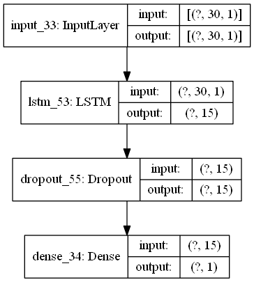
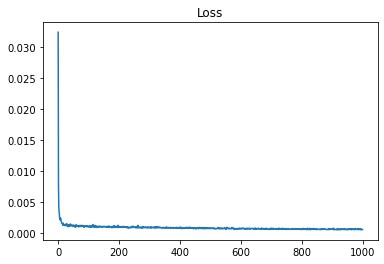
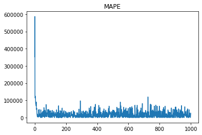
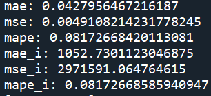
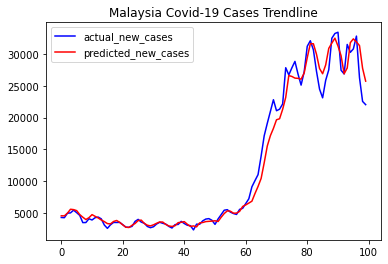
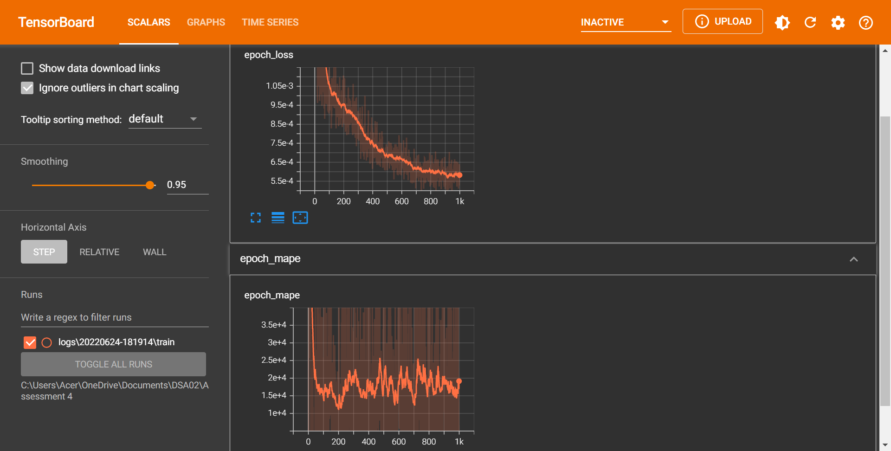

# Forecastive Time-Series Model using Deep Learning of LSTM for Covid-19 Cases in Malaysia.
 Trained nearly 700 official data provided by Ministry of Health Malaysia to forecast Covid-19 cases.

## Description
1. The project's objective is to forecast the Malaysia's Covid-19 cases trend.
2. The data is provided through an offical GitHub page by Ministry of Health (MoH) Malaysia. The link to the GitHub page will be provided in the credit section below.
3. The dataset contains anomalies such as 2 different types of NaNs (which imputed by using df.interpolate()), but no duplicate data.
4. The layers used for the deep learning model are consist of only three layers, input layer, LSTM layer and output layer.

### Deep learning model images

## Results
### Training Loss:

### Training MAPE:

### Model Score:

### Malaysia's Covid-19 Cases Trendline:

## Discussion
1. The model is able to predict the trend of the Covid-19 cases in Malaysia.
2. Mean absolute error(MAE) and mean squared error(MSE) report 4.18% and 0.47% respectively when tested using the testing dataset. 
3. Based on the Loss graph displayed using Tensorboard, loss occured during the dataset training is nearly 0% with a high amount of epochs (1000).

4. The deep learning model used only 3 layers; input layer, LSTM layer and output layer. The number of nodes was set to 15, and the dropout rate was set to 0.03. Rectified linear unit (ReLU) was used as an activation function.
5. Based on the mean absolute percentage error(MAPE) which around 0.08%, this model can be considered as successful as it can predicted the trendline of Covid-19 cases in Malaysia.

## Credits:
The source of the dataset is obtained from GitHub page of Ministry of Health (MoH) Malaysia. Check out the latest dataset by clicking the link below. :smile:
### Dataset link
[Covid-19 Cases in Malaysia](https://github.com/MoH-Malaysia/covid19-public)

